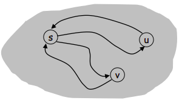
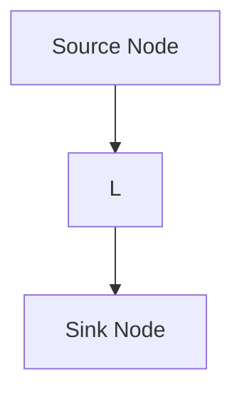
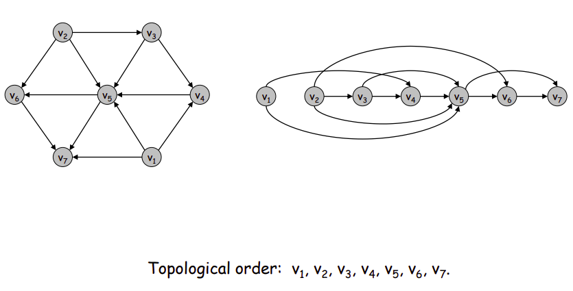

# Projeto de ALloritmos (PA)
## Graph
- Undirected Graphs
- Graph Applications
**Representation**
- Adjacency matrix
- Adjacency list
- Paths and Connectivity
    - Def: um caminho é um grafo não-direcionado, onde G = (V, E) é a sequencia P de nós v_1, v_2,..., v_k, com cada par consecutivo v_i e v_i+1 é unido por uma aresta E.
        - É um caminho de "por onde andei" no nó. Só é possível caminhar atráves de arestas.
    - Um grafo é conectado se: para cada par de nós u e v há um caminho entre u e v.
    - Um grafo não-direcionado é simples se todos os nós são **distintos**.
    - É a estrutura de dados mais importante que conhecemos (lista encadeadas, que são direcionadas; pilha/filas; árvores; hash)
    - Caso o algoritmo de travessia do grafo não seja feito corretamente, o pograma poderia entrar em loop infinito
- Cycles
    - Um circulo é um caminho entre v_1, v_2, ..., v_k-1 v_k, onde k > 3 e os primeiros k-1 nós **devem ser distintos**
    
    - Aqui, 1-2-3-1 é um ciclo com 3 elementos, mas k = 4.
    - Quando k = 3, o uso da aresta é o mesmo para ir e voltar.
- Distancy
    - Def: a distância entre vértices *s* e *t* num grafo *G* é o menos número de arestas que conectam *s* a *t* em *G*.
### Graph Travesal
**Connectivity**
- s-t connectivity problem: dados dois nós *s* e *t* em *G*, existe um caminho entre eles?
- s-t shortest path problem: dados dois nós *s* e *t* em *G*, qual o tamanho do menor caminho entre *s* e t*?
- Applications
    - Maze traversal.
    - Kevin Bacon number
        - Gerou estudos sobre interconectividade entre pessoas, utilizando grafos. Conexão em até 6 grafos para qualquer pessoa do mundo.
    - Fewest number of hops in a communication network.

### Algorithm Analysis
- O tamanho da entrada influencia diretamente no desempenho computacional, onde a complexidade do algoritmo é fator decisivo. Algoritmo > Hardware.
    - Força bruta (!)
    - Problema do caixeiro-viajante
    

### Breadth First Search
- BFS intuition: explora a partir de s todas as possíveis direções, adicionado, andando, uma camada por vez
- Pega um nó, expande e processa esse nó. Impede do algoritmo de andar em círculo voltando para a origem e processando o próximo nó que ainda não foi expandido.
- Abre como uma cebola, de camada em camada.
- **Garante o menor caminho** do nó inicial até o nó de procura.

``` py
for every vertex s of G not explored yet ## BFS(G)
    do Enqueue(S,s)
    mark vertex s as visited
        for each v in Adj[u] then
            if v is unexplored then
                mark edge (v,u) as tree edge
                mark vertex v as visited
                Enqueue(S,v)
```
- BFS(G): passa por todo o grafo, mesmo aquele desconectado.
- BFS(S, t): passa por todos os amigos do Maurício (*S*). Não passa por pontas soltas.
- BFS(G, S, t): busca o menor caminho entre *S* e *t* em *G*. Comum em busca de caminho entre cidades.

**Complexidade**

*O(n + m)* onde *n* é o número de vértices disconexos e *m* é a quantidade de marcações em *n*.

**Observações Importantes**

- As marcações devem ser feitas numa listas de adjacências diversa da original.
- Ao tentar visitar um nó que já havia sido visitado e que possui uma aresta *não marcada*, essa aresta é **descartada** no else.
- Ao explorar *G* contendo dois ou **mais vértices não inter-conectados, primeiro se explora o primeiro nó completamente**. Só depois o algortimo passa para o próximo vértice desconectado, até ter processado todos os vértices.
### Depth First Search
- DFS intuition: explora a partir de *s* em uma única direção, explorando uma camada em profundidade. Quando encontra um caminho sem volta ela retorna e procura outro caminho em profundidade até terminar a busca.
```py
# DFS (G)
for every vertex v of G
    if v is not visited then
        DFS-Visit(G,v)
```
```py
# DFS-Visit (G,v)
mark vertex v as visited
for every w in Adj(v)
    if w is unexplored then
        insert edge (v,w) in tree
        DFS-Visit (G,w)
```
- Não garante o menor caminho na busca, diferente do [DFS](#depth-first-search).

**Propriedades da Busca de Profundidade (DFS)**

**Teorema**: Seja *T* a árvore produzida por uma *DFS* em *G* e seja *(v,w)* uma aresta de *G*. Se *v* é visitado antes de *w*, então *v* é ancestral de *w* em *T*.


- Arestas em preto são da arvore DFS.
- Arestas em laranja são as descartadas pelo algoritmo.

**Nota**: Numa árvore *T* produzida por uma DFS em *G*. Onde existe um caminho entre *v* e *w* e ***v* é visitado antes de *w* não garante que *v* é ancestral de *w* em *T***.


#### Connected Component
**Def Connected set**. *S* é um conjunto conectado se e somente se:
- *v* é alcançavel por *u* e *u* é alcançável por *v*, para cada *u, v* em *S*
**Def Connected Component**
- para todos nós *u*, se tirarmos os nós desse componente do grafo, os nós que restam *u*

> Conjunto conectado é um grafo em que a partir de um nó, pode-se visitar todos os outros, ou seja. Um conjunto **não pode ter grafos desconexos**


- Cada árvore gerada em DFS(G) é um componente em DFS(G,s,t) gera um conjunto conectado, não um componente.

1. **DFS(G)** Quando passa só o grafo *G*, **retorna todos os componentes** e cada componente é uma **arvore**.
2. **DFS(G,s)** Quando passa pela inicial *s*, **retorna um unico componente**. Faz *backgracking* (chamadas recursivas).
3. **DFS(G,s,t)** Já o último pode estar faltando um nó, pois para quando encontrar *t*, e **retorna um conjunto conectado** até *t*.

#### Connectivity
- Forte
- Fraco
- Não-conectado

**Def**: Nó *u* e *v* são **mutuamente alcançáveis** se existe um caminho de *u* para *v* e também um caminho de *v* para *u*.

**Def**: Um grafo é **fortemente conectado** se todo par de nós é mutuamente alcançável.

- Ex: árvores são exemplos de grafos fracamente conectados

Algorithm 1

Algorithm 2

**Lemma**: Let *s* be any node. *G* is strongly connected if every node is reachable from *s*, and *s* is reachable from every node. *s* is an "intermediate node".
- Path from *u* to *v*: concatenate *u-s* path with *s-v* path.
- Path from *v* to *u*: concatenate *v-s* path with *v-u* path.

- Every strongly connected graph can be represented as the image above
---

### Directed Acyclis Graph
**Precedence Constrainsts**
- Sink node: a node that doesn't point to any other node
- Source node: a node that points, but isn't pointed by other nodes



**Topological Ordering Algorithm**


| Ordem |
|---|
**v1** -> v4 -> v5 -> v7
**v2** -> v3 -> v5 -> v6
**v3** -> v4 -> v5
**v4** -> v5
**v5** -> v6 -> v7
**v6** -> v7
**v7** -> 

Nó | Contador
|---|---
v1 | 0
v2 |0
v3 |1
v4 |2
v5 |4
v6 |2
v7 |3

Passos do Algorítmo:
1. Escolher o de menor grau (procurar o menor do array (O(n))
2. Verifica se é 0 (O(1))
3. Colocar na ordenaçção topológica, inserção em fila (O(1))
4. Marcar como deletado (O(1))
5. Em cada vizinho dsse nó, decrementar o valor (O(grau(v)))


#### Macete para trabalhar com Grafos
1. Tentar transformar todos os problemas para o domínio de grafos.
2. Veja grafos até onde não é tão fácil imaginar.

Exemplos:
- Problema de menor rota do waze.
- Em banco de dados, chaves primárias e chaves estrangeiras, com *procedures* no banco tentando processar como grafo.
- Futebol de robôs onde o local no mapa é delimitado por x e y.
- Para pintar uma /PA/imgs/imagem (com o balde do paint por exemplo), Pode-se imaginar um grafo olhando uma matriz de pontos. Sem a necessidade de fazer uma matriz de adjacências pode-se calcular quem são os vizinhos com *x+1, x-1, y+1* e *y-1*, e então realizar uma busca em profundidade *BFS*.

**Observações Importantes**

- Grafos **não garantem ordem**. Por isso a ordem na lista de adjacências não importa.

---

> Vale ressaltar que BFS roda mais rápido que DFS pois não utiliza recursão, logo não tem back-tracking e uso extra de memória. Para **resolver esse problema**, podemos **utilizar uma estrutura de dados de pilha** ao invés de uma fila.
>
> Usar **função in-line** para reduzir o tempo de chamada de função.


