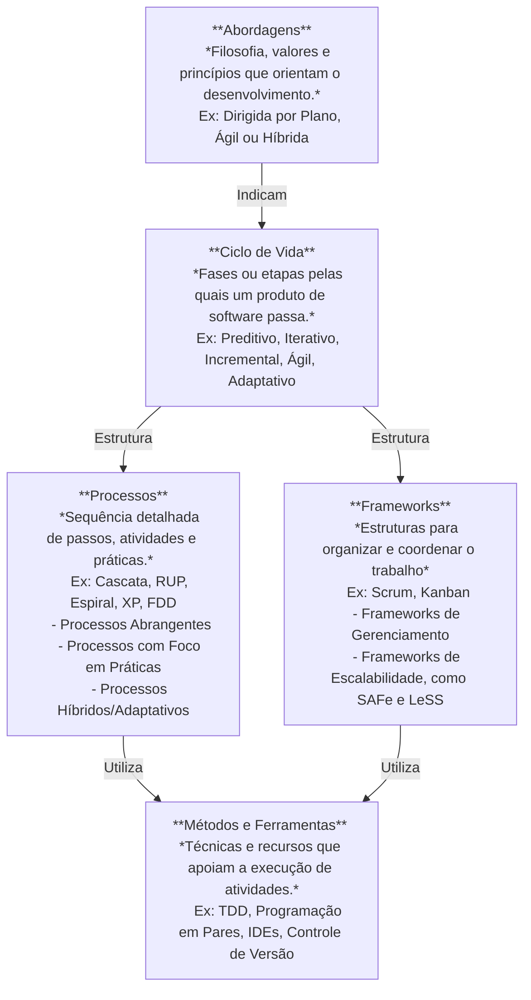
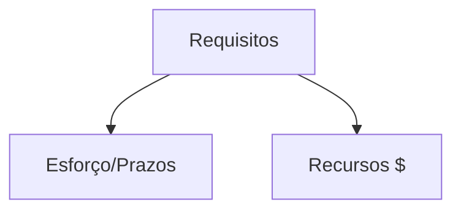
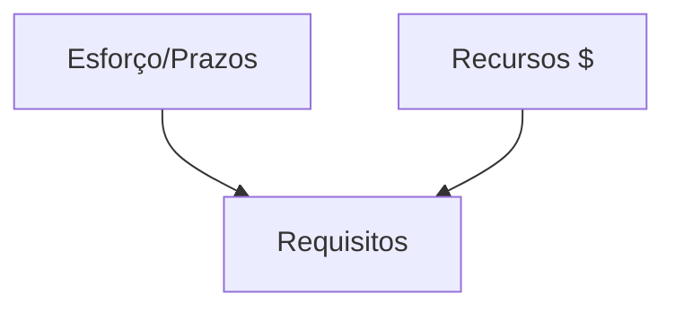
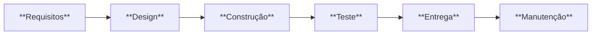
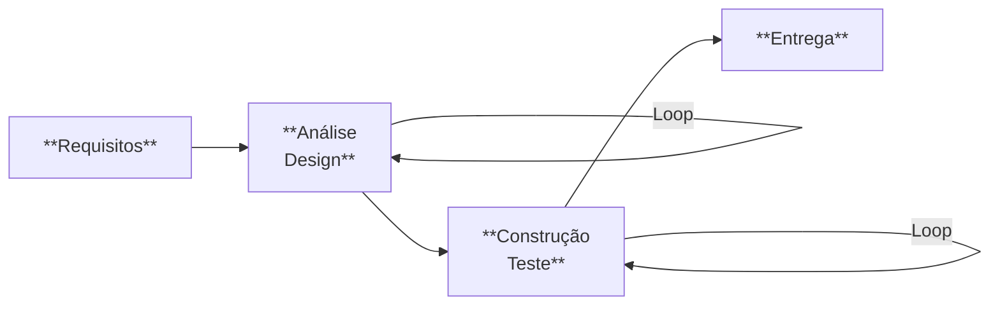
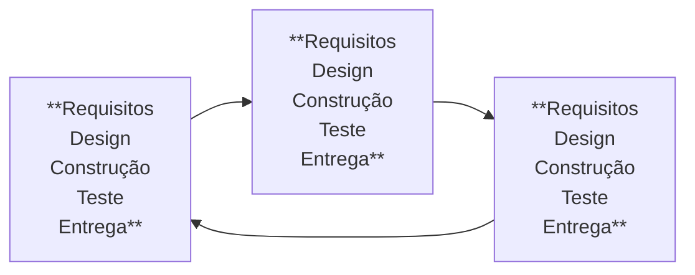

# Anotações Gerais da Matérias de Requisitos de Software (REQ)

>***Software por si só é uma intervenção social***

### Visão Geral de Requisitos

Vale ressaltar que a seleção de elementos deve ser feita levando em consideração características individuais do contexto, como cultura organizaional, equipe e diversos outros fatores.

#### Alguns tipos de Requisitos
Existem diversos tipos de requisitos, como: de privacidade, segurança (voltada pra I.A) e sustentabilidade(pelo uso energético de I.A's).

Ferramentas de Processamento Natural de Linguagem (NLP) para auxiliar na definição de requisitos:
1. Watson RCA.
2. AQUSA.

## Abordagens de Desenvolvimento
### Dirigo por plano
- *Exige formalização*.
- É dedicado tempo considerável para que o **planejamento** e a **organização** sejam muito bem feitos e definidos.
- Ênfase em **previsibilidade**
- Define **completamente** os requisitos antes do planemaneto.
- Requisitos devem ser **estáveis** e **conhecidos**

A seguinte pergunta: "Quanto tempo e quanto custa um software?" é facilmente respondida com o tema base de estudo. Requisitos definem o escopo, que então definem o preço e o tempo do software.
### Ágeis
- Tem **menor formalização**.
- Planejamento e organização é feita em partes, a partir de um conjunto de requisitos, não de todos eles de uma só vez.
- Ênfase em **flexibilidade**, com **requisitos variáveiis**.
- Monitoramento e controle mais flexível e menos rígido. Possível reprogramação a cada iteração.
- Aqui os requisitos podem ser **desconhecidos** e **instáveis**. Por isso tem menor **previsibilidade** e maior **experimentação**. Reprogramação pode e deve ser constante nesses casos.

## Comportamento dos Requisitos
### Dirigido por Plano
Aqui esforços/prazos e recursos são invariavelmente proporcionais aos requisitos, levando em consideranção características como **complexidade** e **quantidade**.

Tem como cerne da tríade (triângulo de ferro) ser orientado ao **plano**. Com topo fixo e base estimada.

### Ágil
Aqui temos $ de orçamento e x mêses de prazo, portanto, os requisitos variam de acordo com esses dois parâmetros.

Tem como cerne da tríade ser orientado a **objetivos** e **valor**. Lembrando que o topo é fixo e a base é estimada

### Híbrida
- Quando se tem um conjunto de requisitos **estáveis** e **conhecidos**, assim como requisitos **desconhecidos** ou **instáveis**.
- Aqui a priorização da abordagem é **contextual**. Podendo mudar de ágil -> híbrida ou vice-versa.
- Rastreabilidade é seletiva.

Obs: ao mudar de abordagens durante um projeto, o triãngulo de ferro inverte e deve ser feita a negociação e comunicação com o cliente.
- Caso o foco seja em previsibilidade, mudar de ágil para dirigido por plano.
- Caso requisitos sejam desconhecidos e voláteis, mudar de dirigido por plano para ágil.

## Ciclo de vida de Software
- Geralmente o tempo de manutenção é maior que o tempo de vida para surgir o produto de software.
> O conceito de **incrementalidade** é um requisito do cliente para o produto. Para ser incremental, deve estar em produção.

### Tipos de ciclo de vida
- Preditivo
    - Abordagem mais tradicional, um processo sequencial (cascata).
    - Requisitos conhecidos e estáveis. Com menor grau de incerteza.

- Iterativo
    - Abordagem que permite **feedback contínuo sobre o trabalho**

- Incremental
    - Abordagem que **fornece produtos acabados** que o cliente pode usar imediatamente.

- Ciclo de vida ágil
    - **Iterativo e incremental**, focando no refinamento dos itens de trabalho e entregas finalizadas, com frequência.
    - **Feedbacks obtidos antecipadamente**, fornecendo controle e confiança ao cliente sobo o produto
- Ciclo de vida iterativo e incremental pode ser dirigido a plano ou ágeis
- Ciclo de vida adptativo
    - *Não é necessário usar uma única abordagem* para um projeto inteiro.
    - Projetos podem combinar elementos para *adaptabilidade*
    - Pode-se combinar caracterśiticas de abordagens *preditivas, iterativas, incrementais* e *ágeis*.

### Características Gerais
| Abordagem    | Requisitos    | Atividades                                | Entrega                     | Objetivo                                      |
|--------------|--------------|------------------------------------------|----------------------------|----------------------------------------------|
| **Preditivo**    | Fixos        | Executadas uma vez para todo o projeto   | Entrega única              | Gerenciar custo                              |
| **Iterativo**    | Dinâmicos    | Repetidas até estarem corretas           | Entrega única              | Correção da solução                          |
| **Incremental**  | Dinâmicos    | Executadas uma vez por incremento        | Entregas menores frequentes| Velocidade                                   |
| **Ágil**         | Dinâmicos    | Repetidas até estarem corretas           | Entregas pequenas frequentes| Valor ao cliente via entregas frequentes e feedback |

## Créditos  
Este resumo foi elaborado com base no material de aula do [**Prof. Dr. George Marsicano**](https://buscatextual.cnpq.br/buscatextual/visualizacv.do;jsessionid=C85769488142EE51BE18F1A42728EB17.buscatextual_0).