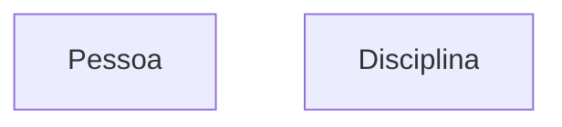
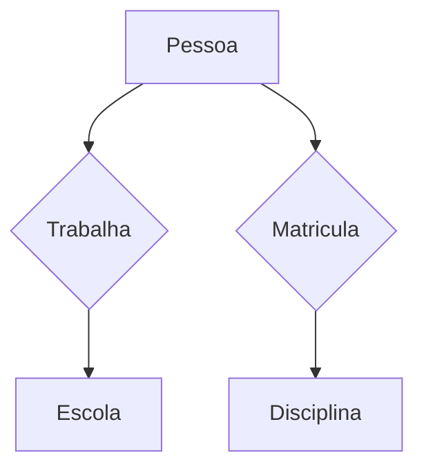
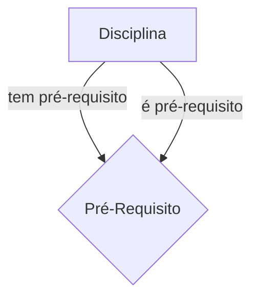

## Sistema de Banco de Dados 1 (SBD1)
### MER - Modelo Entidade Relacionamento
- Voltado apra a representação dos *aspectos estáticos*, informações, do Dompinio da Aplicação
- Diagrama Entidade-Relacionamento
#### Construtores Sintáticos
Constituem:
- Conjunto de Entidades
- Conjunto de Relacionamentos
- Atributos de Entidades
- Atributos de Relacionamentos
São:
- Um modelo de dados que definem um conjunto (limitado) de construtores sintáticos. Um mesmo Construtor Sintático pode ser usado para representar diversas situações reais -> Sobrecarga Semântica.
#### No MER
- Entidades são coisas, objetos, pessoas, etc.
- Conjunto de Entidades são coleções de entidades que têm a mesma "estrutura" e mesmo "significado" na modelagem. Estrutural e semanticamente semelhantes
#### Conjunto de Entidades
- O MER não trata de entidades individuais, apenas **Conjunto de Entidades
**
- Notação DER: retângulo

#### Conjunto de Rleacionamntos
- **Relacionamentos** são associações entre entidades do mundo real
- **Conjunto de Relacionamentos** são as relações entre entidades dos mesmos **CEs**
- Notação DER: losango

#### Atributos
- São valores que representam **propriedades** das entidades e relacionamentos no mundo real.
    - Atributos de entidades
    - Atributos de relacionamentos
    
O mais importante na confecção de um MER é o entendimento das relações entre entidades, não os atributos das entidades entre si.
#### Conjunto
- Não devemos assumir que há uma ordem entre os dados
- São a base dos SGBD, principalmente os relacionais
**Como definir conjuntos em SGBD?**
- Por restrição de unicidade
    - Todo conjunto deve ter um atributo, ou conjunto de atributos, que identifique **univocamente** cada entidade. Isso é chamado de **chave**.
##### Restrição de Unicidade - Chave
- Chave Simples
    - Notação DER: o atributo chave deve ser grifado
- Chave
    - É referenciando uma entidade a uma chave que se é possível referenciar uma entidade com outra
    - Principal meio de acesso a uma entidade
    - Outros atributos identificadores possíveis podem ser anotados de forma separada, para efeito de documentção e projeto lógico.
- Chave primária deve ter um sublinhado, chaves segundárias devem ter duas.
- Chave Composta
    - Entidade precisa de mais de um atributo para identificação, para robustes e identificação precisa
    - Vários dados trabalhando como se fossem uma coisa só. Concatenação de atributos, indicando uma **chave única**
    - Notação DER: todos os atributos da chave grifados
#### Atributos
Ex: Onde colocar o atributo Nota?

Deve ser colocado no **relacionamento** entre pessoa e disciplina.
- Atributos simples vs Composto
    - Simples (atômico): não divido; uma única parte (CPF)
        - Para CPF, pode-se fazer um espaço do tipo único para o CPF
    - Composto: dividido em partes; possui sub-atributos (endereço)
        - Para endereços, não é uma boa prática colocar tudo num campo *String*, mas sim separar em sub-atributos.
- Em bancos de dados, o ideal é fechar e deixar o mais estruturado possível.

- Bancos de dados são extremamente tipados.
- Nas tabelas em conjunto de dados
    - Pense como uma planilha do Excel.
    - Na Tabela do Conjunto de Entidades Aluno, cada linha representa uma tupla, uma entidade única, com as colunas sendo os atributos desse Conjunto de Entidades.
    - Pode-se relacionar com OO, onde Aluno seria a classe e cada linha seria uma instância de Aluno.
**Tipos de Atributos**
- Monovalorado vs Multivalorado
    - Monovalorado: pode assumir um único valor para um(a) entidade/relacionamento 
    - Multivalorado: pode assumir mais de um valor para um(a) entidade/relacionamento
        - Para um único aluno há várias instâncias de notas, como um array
        - Notação: elipse dupla
- Armazenado vs Derivado
    - Armazenado: atributo da entidade
    - Derivado: são valores obtidos a partir de outros valores. Não necessariamente está no banco.
        - Pode ser um atributo que toda hora é calculado, como IRA, idade.
        - Pode ser um atributo derivado, mas já armazenado, como nº de alunos.
    - > Vida máxima pode ser derivada se for baseada em força/stamina, por exemplo.
        - Caso o sistema não tenha muitos acessos, é viável armazenar um atributo e então atualizar apenas quando necessário. Ex: número de alunos de uma turma, feito com incremento e decremento, ao invés de calcular todas as vezes.
        - > So o atributo for derivado do calculo de outros atributos, mesmo que esteja no banco, o mesmo deve ser tracejado.
        
#### Conjunto de Relacionamentos - Papéis
- Cada CE que participa de um CR tem um **papel** no CR, com uma indicação opcional. Pode-se entender isso como um requisito não-funcional

- Indicação de papéis deve ser feita para evitar ambiguidade na interpretação do CR
Quando há papéis distinto nos CEs em Crs distintos, pode-se adotar os papéis para auxiliar no entendimento do Modelo

**Auto-Relacionamento**
- Quando um mesmo CE desempenha mais de um papel num mesmo CR

#### Cardinalidade
- Garante que seja impossível relacionar um pedido para dois clientes distintos.
- É uma restrição estrutural
- Determina o nº de relacionamentos das quais cada entidade pode participar
> Uma sala pode ter (0:N) personagens, um personagem pode estar em (1:1) sala

- Ex: ao entrar na UnB, entregamos a foto. Essa foto precisa ser amazenada numa coluna do tipo blob (binary large object) ou string de bits (4M, 25M, ...). Faz-se uma tabela para foto, por ser grande, e referencia por uma chave a tabela com os outros atributos de Aluno. Pois assim o sistema não fica lento em consultas.
    - Ex: matricula em alguma matéria. Não é necessário ler a foto, os 25M, apenas dados leves, strings, numeros, bits de dados para a matrícula.

> **Pq não armazenar informações no banco como um grafo?**
>
> Diretamente impactado pelo Hardware. Hoje **banco de dados Não-relacionais são feitos em grafos**. No HD, por conta da cabeça de leitura que tem que ir pra FAT (File Alocation Table), para saber onde estão os arquivos e depois voltar para ler o arquivo. A latência é muito grande ao invés de ser uma leitura sequencial.
>
> A leitura que o HD faz é por **blocos**. 
> Quando o sistema vai ler um arquivo sequencial, o primeiro bloco que o HD trás, de mil alunos por exemplo, já posso trazer o próximo bloco de alunos. Em grafos, o sitema lê o primeiro bloco, aproveito apenas o primeiro aluno dos mil e depois busca outro bloco, para aproveitar apenas o primeiro novamente, gerando latência.

#### Conjunto de Relacionamentos - Restrição de Participação
**Participação Total**
- Toda entidade deve obrigatoriamente participar de um relacionamento, sendo assim associada a uma entidade.

**Notação DER**: linha dupla conectando o CE ao CR

Exemplo: toda entidade **Disciplina** participa de um relacionamento **Possui* e deve estar associada a uma entidade **Curso**.

#### Conjunto de Relacionamentos - Entidade Fraca
**Entidade Fraca**
- Não possui identificador único (chave), ou atributo identificador **univoco semânticamente** do domínio da aplicação 
- Identificação depende do relacionamento com outra entidade ou outro conjunto. Chamado **owner**.
**Notação DER**
- Entidade Fraca: traço duplo no retângulo
- CR Identificador: traço duplo no losango
- Chave Parcial: *um ou mais* atributos de CEs Fracas para **identificação univoca em relação a um mesmo owner**

**Conjunto de Entidades Fracas**
- Possui **participação total** no CR, chamado de **CR identificador**
- Cardinalidade é sempre 1:N ou 1:1, mas nunca N:M.

**Quando modelar como Entidade Fraca?**
- Quando tiver muitos atributos.
- Quando participar de outros relacionamentos além do owner.

#### Conjuntos de Relacionemtos - Grau
- Um Conjunto de Relacionamentos (CR) pode envolver **dois** ou **mais** Conjuntos de Entidades (CE)
- **Grau** do CR é o número de CEs envolvidos
    - Dois CEs -> CR Binários
    - Trẽs CEs -> CR Ternário
    
    - Aqui, não era necessário ter utilizado Professor que auxilia, pois cada Disciplina tem um Professor específico. Caso contário, qualquer professor poderia auxiliar em uma matéria, que poderia nem ser de seu domínio.
    - Para relacionamento binário, fixar um lado (0:1) e abrir do outro (0,N). Ex: um aluno está monitorando uma disciplina

Todo lugar que a caridinalidae for 1. Tirar 

Item -> Possui (CR Fraca) -> Instância (CE Fraca) (0,N) -> Está -> (0,1) Sala

## Dicas Projeto

Poção. O personagem toma, pegar essa poção e "jogar" de volta para a loja.

Para guardar um atributo que foi modificado ex: o monstro muda de comportamento quando viu o personagem. Mas daí o monstro morre e queremos que ele ainda lembre dessa informação. Devemos mandar esse monstro pra sala do limbo e depois respawnar essa mesma instância sem apagar os dados.

Não ter 58 itens iguais na tabela, pois todos os atributos daquele item serão iguais (ex: 38). Sol: uma linha só, com os dados da 38, e então criar instâncias

> [!NOTA] Devemos criar uma linha para cada TIPO de monstro/item, e depois apenas instâncias para interagir com o jogo.

> [!NOTA] Para monstro e itens, devemos ter o molde, e as instâncias de cada um deles. Ps: obrigado João.
> - Um monstro pode fugir se estiver com pouca vida. 
> - Um monstro pode ter seus atributos aleatórios assim que for "gerado". 

> [!Recomendação] Tocha, pedra, monstro: usar como instâncias

> [!NOTA] Por exemplo, você tem um item, falamos que um item está em várias salas. PQ em várias salas? Pois pode ter pedra em qualquer lugar, por isso o item está em várias salas (isso tem um lado ruim). Ex: o personagem tem uma espada e numa batalha ele leva uma falha crítica, pode-se dizer que a espada quebrou. Como qeubrar só a espada dele sem quebrar a dos outros? Como dizer q ele pegou os restos da espada?

> [!NOTA] A espada vai perdendo o dano ao dar golpes. Como identificar que a espada daquele personagem está perdendo "vida" ao atacar? Resposta: INSTÂNCIAS

> [NOTA] O inventário do personagem é uma entidade fraca 1:1 com o personagem

> [!NOTA] No jogo, o personagem mata um monstro, para anotar o nro de ataques, esse numero deve ser anotado no "Derrota", não no personagem ou no monstro. 

> [!Recomendação e Uso de PA] Grafos para menor caminho entre inimigos e jogar em perseguição, DFS para movimentos mais random icos e BFS para padronizados.

> Assistir aulas 1 e 2
> - [Aula 1](https://aprender3.unb.br/mod/url/view.php?id=1404588)
> - [Aula 2](https://aprender3.unb.br/mod/url/view.php?id=1404590)

